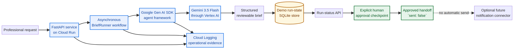
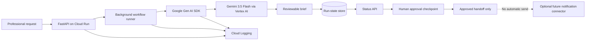

# Automatom — BriefRunner

**Automatom — BriefRunner** is an approval-gated background agent that turns a recurring professional request into a concise, reviewable briefing. It addresses the gap between a one-off chat response and dependable work progress: the agent drafts a structured brief asynchronously, persists the run state, and stops before any external communication so a person remains responsible for approval.

> **Hackathon category:** Taskmaster. BriefRunner performs a bounded, multi-step workflow in the background rather than presenting a generic chat interface.

## Submission compliance

The All Things Agentic Hackathon requires Gemini 3.5 or later, a Google agent framework, and a Google Cloud infrastructure service. This implementation uses all three in the production path. The local deterministic mode is provided only so reviewers can inspect the approval workflow without credentials; it is never presented as Gemini output. [1]

| Required element | BriefRunner implementation | Evidence reviewers can inspect |
|---|---|---|
| Gemini model | `gemini-3.5-flash` invoked through Vertex AI | `app/google_runtime.py` and the live `/health` endpoint |
| Google agent framework | Google Gen AI SDK (`google-genai`) | `requirements-google.txt` and `app/google_runtime.py` |
| Google Cloud infrastructure | Cloud Run container deployment | `Dockerfile`, deployment commands, Cloud Run service URL, and video evidence |
| Autonomous workflow | FastAPI starts a background run, then exposes its status | `POST /demo-runs`, `GET /runs/{runUid}` |
| Human control | A result remains `awaiting_approval`; approval never sends a message | `POST /runs/{runUid}/approve` and automated tests |

## Architecture



A request first enters the FastAPI service running on Cloud Run. The background runner invokes the Google Gen AI SDK, configured for Vertex AI Application Default Credentials, to call Gemini and produce a reviewable brief. The run and its status are stored locally for this small demonstration. The API exposes the result for review; an explicit approval only records an approved handoff state and never dispatches a notification.



## What happens during a run

1. `POST /demo-runs` accepts a plain-English intent and records a queued workflow.
2. The background worker marks the run as running and creates a structured brief with Gemini when Vertex AI is configured.
3. `GET /runs/{runUid}` returns queued, running, or completed state plus the reviewable result.
4. The completed result reports `awaiting_approval`, `approvalRequired: true`, `notificationStatus: "pending_approval"`, and `sent: false`.
5. `POST /runs/{runUid}/approve` records approval but preserves `sent: false`.

The restriction on outbound action is deliberate. The demo does not claim access to live competitor data, execute arbitrary code, or send a message without a clearly visible human checkpoint.

## Run locally

### Deterministic review mode (no cloud credentials)

This mode is intended for inspecting the API contract and safety boundary. It does **not** call Gemini.

```bash
git clone <submission-repository-url>
cd automatom-briefrunner
python -m venv .venv
. .venv/bin/activate
pip install -r requirements-google.txt
PYTHONPATH=app uvicorn main:app --reload --port 8000
```

Start a run in a second terminal:

```bash
curl -sS -X POST http://localhost:8000/demo-runs \
  -H 'content-type: application/json' \
  -d '{"intent":"Prepare a weekly competitor brief for a small professional team"}'
```

Copy `runUid` from the response and poll it:

```bash
curl -sS http://localhost:8000/runs/<runUid>
curl -sS -X POST http://localhost:8000/runs/<runUid>/approve
```

### Gemini on Vertex AI

This is the production configuration used for Cloud Run. Authenticate with Application Default Credentials or deploy with a Cloud Run service account authorized to invoke Vertex AI. Never commit API keys or service-account keys.

```bash
export AUTOMATOM_AGENT_MODE=gemini
export GOOGLE_GENAI_USE_VERTEXAI=true
export GOOGLE_CLOUD_PROJECT=<your-project-id>
export GOOGLE_CLOUD_LOCATION=us-central1
export GEMINI_MODEL=gemini-3.5-flash
PYTHONPATH=app uvicorn main:app --port 8000
```

Open `http://localhost:8000/health`. A correctly configured production path reports `agentMode: "gemini"`, `agentFramework: "Google Gen AI SDK"`, `vertexAiConfigured: true`, and `cloudTarget: "Cloud Run"` without exposing secrets.

## Deploy to Cloud Run

The following commands build the container from `Dockerfile`, deploy it to Cloud Run, and configure the Google-native agent path. Use a service account with the least privileges necessary to invoke Vertex AI and write Cloud Logging entries. The command deliberately keeps the service unauthenticated only for a hackathon demo endpoint; use IAM authentication for non-demo deployments.

```bash
PROJECT_ID=<your-project-id>
REGION=us-central1
SERVICE=automatom-briefrunner

gcloud config set project "$PROJECT_ID"
gcloud services enable run.googleapis.com aiplatform.googleapis.com cloudbuild.googleapis.com

gcloud run deploy "$SERVICE" \
  --source . \
  --region "$REGION" \
  --allow-unauthenticated \
  --set-env-vars "AUTOMATOM_AGENT_MODE=gemini,GOOGLE_GENAI_USE_VERTEXAI=true,GOOGLE_CLOUD_PROJECT=$PROJECT_ID,GOOGLE_CLOUD_LOCATION=$REGION,GEMINI_MODEL=gemini-3.5-flash"

gcloud run services describe "$SERVICE" \
  --region "$REGION" \
  --format='value(status.url)'
```

After deployment, verify the returned `.run.app` URL before adding it to the Devpost form:

```bash
SERVICE_URL=$(gcloud run services describe "$SERVICE" --region "$REGION" --format='value(status.url)')
curl -sS "$SERVICE_URL/health"
```

## Test the repository

```bash
python -m pytest -q
```

The tests exercise the deterministic contract, approval behavior, and the camel-case payload returned by the API. They do not make paid cloud calls.

## Demo video checklist

The submission video must be public on YouTube or Vimeo, in English, and no longer than four minutes. It should show the problem, the value proposition, a live run and approval checkpoint, plus direct proof of the backend running on Google Cloud (for example, the Cloud Run dashboard, service URL, or Vertex AI logs). [1]

| Suggested time | Visible proof |
|---|---|
| 0:00–0:25 | The recurring briefing problem and why an approval-gated agent helps |
| 0:25–0:50 | Cloud Run service dashboard and the `.run.app` URL or `/health` response |
| 0:50–2:20 | `POST /demo-runs`, polling a Gemini-mode run, and the generated reviewable brief |
| 2:20–2:50 | `POST /runs/{runUid}/approve`, showing `sent: false` |
| 2:50–3:20 | Architecture diagram, Google Gen AI SDK, Gemini on Vertex AI, and Cloud Run |
| 3:20–3:40 | Transparent scope statement and closing value proposition |

## Project-history disclosure

BriefRunner’s hackathon-specific work was created during the Submission Period, including the BriefRunner workflow, Google Gen AI SDK integration, Vertex AI configuration, Cloud Run packaging, architecture, test updates, and submission documentation. The project incorporates pre-existing generic Automatom workflow scaffolding. The exact scope, provenance, and licensing of that reuse are disclosed in [`PRE_EXISTING_WORK.md`](PRE_EXISTING_WORK.md), as the official rules require. [1]

## License

MIT. See [`LICENSE`](LICENSE).

## References

[1]: https://allthingsagentichackathon.devpost.com/rules "All Things Agentic Hackathon Official Rules"
